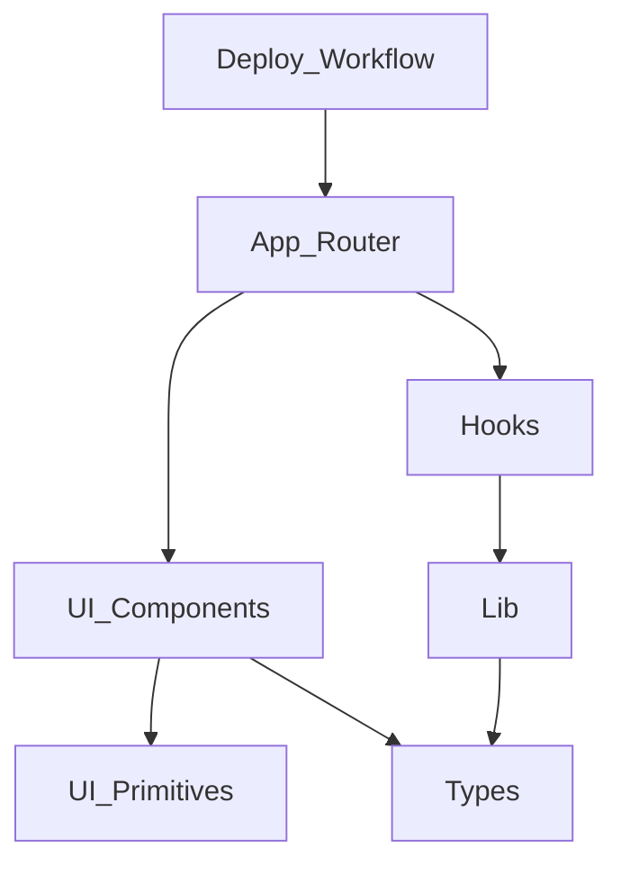

## Stack
- Next.js 14 (App Router) + TypeScript, per package.json.
- Tailwind CSS v3 + tailwindcss-animate, shadcn/ui + Radix UI primitives (package.json).
- react-dropzone (uploads), @dnd-kit (reordering), jsPDF (PDF generation), exifr (EXIF), sonner (toasts), next-themes (theming) — all in package.json dependencies.
- 100% client-side: no backend, no env vars (README.md L3-5, L110).

## Directory map
| path | what lives there |
| --- | --- |
| app/ | Next.js App Router entry: layout.tsx, page.tsx, globals.css |
| components/ | Feature UI: header, footer, image-uploader, image-grid, image-card, settings-panel, generate-bar, empty-state, theme-provider, theme-toggle |
| components/ui/ | shadcn/ui primitives: button, card, input, select, label, progress, radio-group, separator, sonner, tooltip |
| hooks/ | use-image-upload.ts, use-pdf-generator.ts, use-pdf-settings.ts |
| lib/ | constants.ts, format.ts, image-utils.ts, pdf-generator.ts, utils.ts |
| types/ | index.ts (shared TypeScript types) |
| .github/workflows/ | deploy.yml (GitHub Pages static export workflow) |

## Diagram

## Component index
- [[App_Router]]
- [[UI_Components]]
- [[UI_Primitives]]
- [[Hooks]]
- [[Lib]]
- [[Types]]
- [[Deploy_Workflow]]

## Entry points
- Dev: `npm run dev` → `next dev`, serving `app/page.tsx` via `app/layout.tsx` (package.json scripts, app/layout.tsx).
- Prod: `npm run build` (`next build`) then `npm run start` (`next start`); GitHub Pages build uses `output: "export"` in next.config.mjs (README.md L146-151).

## Conventions
- Page is a client component (`"use client"` at top of app/page.tsx).
- State/behavior extracted into hooks (`useImageUpload`, `usePdfSettings`, `usePdfGenerator`) consumed by app/page.tsx.
- Metadata/viewport declared via Next.js `Metadata`/`Viewport` exports in app/layout.tsx.
- shadcn/ui primitives isolated under components/ui/, separate from feature components in components/.

## Where things go
- New PDF option (e.g. new page size/quality preset): edit lib/constants.ts, wire through hooks/use-pdf-settings.ts and lib/pdf-generator.ts, expose in components/settings-panel.tsx.
- New upload behavior/validation: hooks/use-image-upload.ts and lib/constants.ts (ACCEPTED_MIME_TYPES, MAX_FILE_SIZE_BYTES).
- New shadcn primitive: add under components/ui/, then consume from components/.
- New page-level route: add under app/ following the existing layout.tsx/page.tsx pattern.
- Shared type: types/index.ts.
